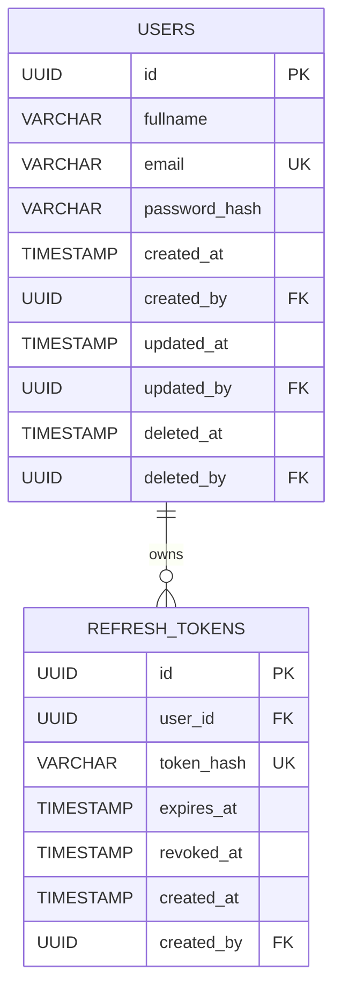

# ERD

## Authentication & User

```mermaid
erDiagram
    USERS {
        UUID id PK
        VARCHAR fullname
        VARCHAR email UK
        VARCHAR password_hash
        TIMESTAMP created_at
        UUID created_by FK
        TIMESTAMP updated_at
        UUID updated_by FK
        TIMESTAMP deleted_at
        UUID deleted_by FK
    }

    REFRESH_TOKENS {
        UUID id PK
        UUID user_id FK
        VARCHAR token_hash UK
        TIMESTAMP expires_at
        TIMESTAMP revoked_at
        TIMESTAMP created_at
        UUID created_by FK
    }

    USERS ||--o{ REFRESH_TOKENS : owns

```