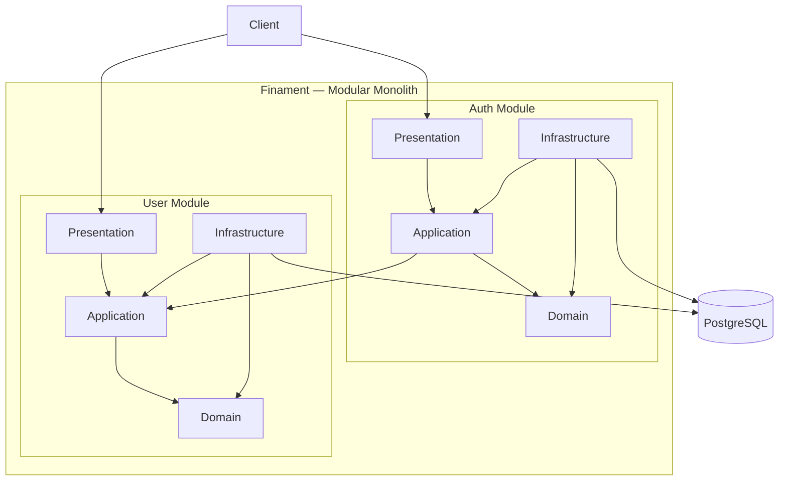

# Architecture

## Overview

| Item                     | Specification         |
| ------------------------ | --------------------- |
| Architecture Style       | Modular Monolith      |
| Application Architecture | Clean Architecture    |
| Deployment Model         | Single Application    |
| Backend                  | Java 17 + Spring Boot |
| Database                 | PostgreSQL            |
| API Style                | REST                  |
| Authentication           | JWT + Refresh Token   |

## Architecture Approach

Finament menggunakan **Modular Monolith** dengan penerapan **Clean Architecture pada setiap module**.

Seluruh module berjalan dalam satu aplikasi dan satu deployment unit, tetapi masing-masing module memiliki boundary dan tanggung jawab yang terpisah.

Pendekatan ini memungkinkan aplikasi tetap sederhana untuk tahap MVP tanpa kehilangan separation of concerns dan modularity.

```text
Finament
│
├── Auth Module
│   ├── Domain
│   ├── Application
│   ├── Infrastructure
│   └── Presentation
│
└── User Module
    ├── Domain
    ├── Application
    ├── Infrastructure
    └── Presentation
```

## Modules

| Module | Responsibility                                                      |
| ------ | ------------------------------------------------------------------- |
| `auth` | Registration, login, token refresh, logout, dan password management |
| `user` | User profile management                                             |

## Clean Architecture Layers

Setiap module menerapkan empat layer utama.

| Layer          | Responsibility                                                  |
| -------------- | --------------------------------------------------------------- |
| Domain         | Business entity, business rule, dan domain behavior             |
| Application    | Use case dan application orchestration                 |
| Infrastructure | Database, security, external service, dan implementation detail |
| Presentation   | REST controller, request DTO, dan response DTO                  |

## Dependency Rule

Dependency antar layer harus mengarah ke dalam.

```text
Presentation
     ↓
Application
     ↓
Domain

Infrastructure
     ↓
Application Ports
     ↓
Domain
```

Domain tidak boleh bergantung pada framework, database, HTTP, atau infrastructure implementation.

Application layer tidak bergantung langsung pada implementation detail infrastructure.

Application mendefinisikan port atau interface yang dibutuhkan untuk berkomunikasi dengan infrastructure.

Infrastructure menyediakan implementasi dari port tersebut.

Contoh:

```Text
Application
    │
    │ depends on
    ▼
UserRepository
    ▲
    │ implements
    │
Infrastructure
```

Dengan demikian, Application tidak mengetahui apakah data disimpan menggunakan PostgreSQL, database lain, atau mekanisme persistence lainnya.

## Module Boundary

Setiap module memiliki boundary dan bertanggung jawab terhadap domain yang dimilikinya.

Module tidak boleh mengakses internal implementation module lain secara langsung.

Auth tidak boleh mengakses secara langsung:

```text
User Entity
User Repository Implementation
User Database Table
```
milik User Module.

Jika Auth membutuhkan kemampuan dari User Module, komunikasi dilakukan melalui contract atau application port yang disediakan oleh module tersebut.

Contoh:

```text
Auth Module
     │
     │ uses User contract
     ▼
User Module
```

Dengan pendekatan ini, perubahan internal User Module tidak secara langsung memengaruhi Auth Module.

## Domain Ownership

Setiap module memiliki ownership terhadap domain dan data yang menjadi tanggung jawabnya.

| Module | Domain Ownership                           |
| ------ | ------------------------------------------ |
| `auth` | Authentication dan refresh token lifecycle |
| `user` | User profile dan user identity             |

`User` merupakan domain entity milik User Module.

`RefreshToken` merupakan domain entity milik Auth Module.

Auth Module tidak mengakses internal `User` entity secara langsung.

## Request Flow

Request diproses melalui Presentation dan Application layer.

```text
Client
  ↓
Presentation
  ↓
Application / Use Case
  ↓
Domain
```

Ketika membutuhkan persistence atau infrastructure service:

```text
Application
  ↓
Port / Interface
  ↓
Infrastructure
  ↓
PostgreSQL
```

Contoh request registration:

```text
POST /api/v1/auth/register
          ↓
Auth Controller
          ↓
Register User Use Case
          ↓
User Contract / Port
          ↓
User Module
          ↓
User Repository Port
          ↓
User Repository Implementation
          ↓
PostgreSQL
```

Auth tidak mengakses `UserRepository` implementation atau database secara langsung.

## Architecture Diagram



## Deployment Model

Finament menggunakan **single deployment unit**.

```text
                    Finament Application
                           │
          ┌────────────────┴────────────────┐
          │                                 │
     Auth Module                       User Module
          │                                 │
          └────────────────┬────────────────┘
                           │
                      PostgreSQL
```

Module `auth` dan `user` tidak dideploy sebagai service terpisah.

Keduanya berjalan dalam satu Spring Boot application dan dapat dikembangkan serta diuji secara modular.

## Architecture Principles

| Principle              | Description                                                                                  |
| ---------------------- | -------------------------------------------------------------------------------------------- |
| Modularity             | Setiap module memiliki responsibility dan boundary yang jelas.                               |
| Separation of Concerns | Domain, application, infrastructure, dan presentation memiliki tanggung jawab yang terpisah. |
| Dependency Inversion   | Application bergantung pada abstraction, bukan infrastructure implementation.                |
| Domain Independence    | Domain tidak bergantung pada framework atau infrastructure.                                  |
| Data Ownership         | Setiap module memiliki ownership terhadap domain dan data yang menjadi tanggung jawabnya.    |
| Single Deployment      | Seluruh module dideploy sebagai satu aplikasi.                                               |
